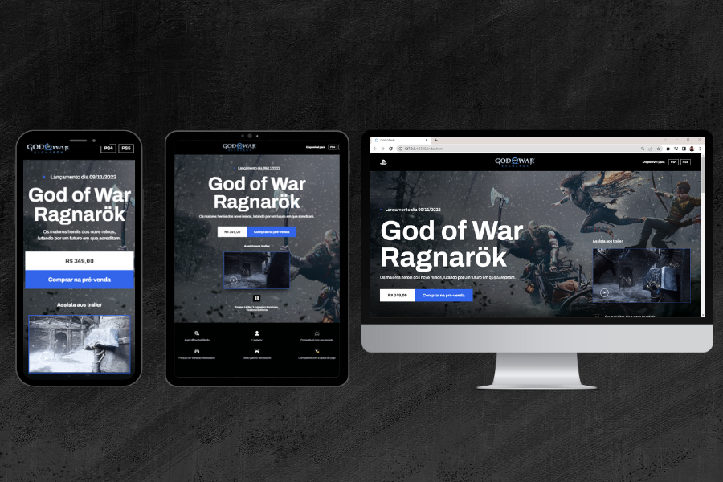

<h1 align="center"> God of War Ragnarök </h1>

Evento exclusivo e gratuito, promovido pelo codeboost para ensino de tecnologias WEB.

  <a href="#-tecnologias">Tecnologias</a>&nbsp;&nbsp;&nbsp;|&nbsp;&nbsp;&nbsp;
  <a href="#-projeto">Projeto</a>&nbsp;&nbsp;&nbsp;|&nbsp;&nbsp;&nbsp;
  <a href="#-layout">Layout</a>

 

  

## 🚀 Tecnologias

Esse projeto foi desenvolvido com as seguintes tecnologias:

- HTML
- SASS
- JavaScript
- AOS
- Swiper

## 💻 Projeto

O projeto simula a home page do lançamento do jogo God of War Ragnarök. Onde é possível ver várias implementações de animações que deixam a home page mais fluida e agradável de visitar.

## 🔖 Layout

Você pode visualizar o layout do projeto através [DESSE LINK](https://www.figma.com/file/BPHOdrrzDnuvKPurADmIsW/Codeboost---God-of-War-Ragnarok?node-id=0%3A1&t=OA84dNjI9xfIFibb-0). É necessário ter conta no [Figma](https://figma.com) para acessá-lo.

---

 

Feito com ♥ by codeboost

